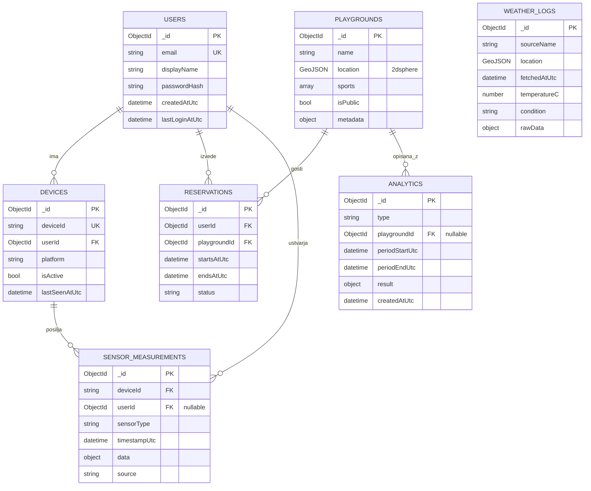
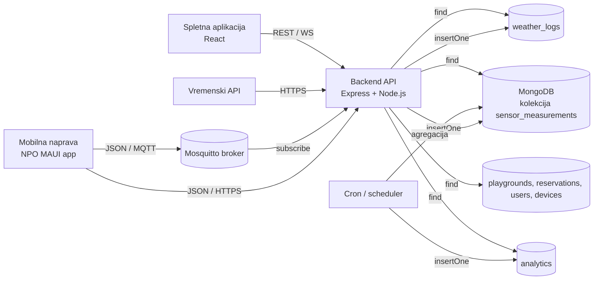

# ER model in relacije podatkovne baze

Naloga: **SCRUM-7 — Modeliranje podatkovne baze**

Ta dokument formalno opredeljuje podatkovni model projekta *Smart Playgrounds*:
entitete (kolekcije), atribute, relacije, kardinalnosti ter ločnico med
surovimi in obdelanimi podatki. Nadgrajuje opisni model iz
[`model-baze.md`](./model-baze.md) (SCRUM-6) in JSON specifikacijo iz
[`mongodb-collections.json`](./mongodb-collections.json), tako da lahko
backend (SCRUM-9, SCRUM-10, SCRUM-20) podatke implementira brez nadaljnjih
odločitev o strukturi.

## Cilj dokumenta

- definirati vse entitete in njihove ključne atribute,
- prikazati relacije in kardinalnosti v obliki ER diagrama,
- opredeliti pretok podatkov skozi sistem (mobilna naprava → broker → backend → baza),
- formalno ločiti **surove** in **obdelane** podatke ter določiti pravila prehajanja,
- opisati pravila referenčne integritete v MongoDB (kjer tuji ključi niso vsiljeni),
- pripraviti vzorčne dokumente in razloge za izbrane indekse.

---

## 1. ER diagram

Diagram prikazuje sedem kolekcij, njihove ključne atribute in relacije.
Oznake kardinalnosti sledijo Crow's Foot notaciji:
`||` = točno ena, `o{` = nič ali več.



> Kolekciji `WEATHER_LOGS` in `ANALYTICS` v diagramu nimata trde povezave na
> druge kolekcije, ker ju vežemo na entitete *po lokaciji* (geoprostorska
> poizvedba) ali *po obdobju*. Glej razdelek 3 (relacije in integriteta).

---

## 2. Pretok podatkov skozi sistem



Diagram pojasni, zakaj je smiselna delitev kolekcij na surove in obdelane
(razdelek 4): kolekcije `sensor_measurements` in `weather_logs` so
*write-heavy* prejemniki nepredelanih podatkov, kolekcija `analytics` pa
nastane šele po naknadni obdelavi.

---

## 3. Relacije in referenčna integriteta

MongoDB ne vsiljuje tujih ključev, zato se referenčna integriteta
zagotavlja na **aplikacijski ravni** (backend). Spodnja tabela je
zavezujoča specifikacija za SCRUM-9, SCRUM-10 in SCRUM-20.

| Iz kolekcije | V kolekcijo | Tuji ključ | Kardinalnost | Pravilo ob brisanju starša |
|---|---|---|---|---|
| `devices` | `users` | `userId` | N : 1 | ob izbrisu uporabnika označi `device.isActive = false`, ne briši zapisov (revizijska sled) |
| `sensor_measurements` | `devices` | `deviceId` | N : 1 | ne briši; `deviceId` je *string* iz aplikacije, ne `ObjectId` |
| `sensor_measurements` | `users` | `userId` (nullable) | N : 0..1 | nastavi `null`, če uporabnika ni več |
| `reservations` | `users` | `userId` | N : 1 | ohrani zapis, dodaj `status = 'cancelled'` |
| `reservations` | `playgrounds` | `playgroundId` | N : 1 | prepoved brisanja igrišča, dokler ima aktivne rezervacije |
| `analytics` | `playgrounds` | `playgroundId` (nullable) | N : 0..1 | nastavi `null` (globalna analitika ostane) |

**Ključne odločitve:**

- `deviceId` je *string* (aplikacijsko generiran identifikator), ne MongoDB
  `ObjectId`. To omogoča, da naprava ohrani identiteto, tudi če zapis
  v kolekciji `devices` še ne obstaja (npr. prva meritev pred registracijo).
- `userId` je v `sensor_measurements` *nullable*: meritev se lahko sprejme
  tudi pred prijavo uporabnika in se kasneje pripiše uporabniku z
  *update many*.
- `playgroundId` v `analytics` je *nullable* zaradi globalnih agregatov
  (npr. povprečje aktivnosti vseh igrišč v Mariboru).

---

## 4. Surovi proti obdelanim podatkom

To je drugi obvezni rezultat naloge SCRUM-7 (po PDF terminskem planu:
*"Definicija tabel — surovi vs. obdelani podatki"*). Namen ločitve je
preprečiti, da bi *write-heavy* nepredelani vhodi onesnažili poizvedbe
za vizualizacijo, ter omogočiti različne politike hrambe (raw lahko po
določenem času premaknemo v hladno arhivo).

### 4.1 Definicija

- **Surovi podatek** je dokument, zapisan v bazo *natanko v obliki, kot je
  prispel iz vira* (mobilne aplikacije, MQTT brokerja, zunanjega API),
  brez agregacije, brez izvedenih polj. Edine dovoljene transformacije
  ob vpisu so: validacija po JSON shemi, dopolnitev `*_AtUtc` polj in
  pripis identifikatorjev (`userId` po prijavi).
- **Obdelan podatek** je dokument, ki nastane *kot rezultat izračuna nad
  enim ali več surovimi zapisi* (povprečja, štetja, časovne serije,
  zaznavanje vzorcev). Vedno ima referenco na obdobje izračuna in čas
  nastanka.

### 4.2 Klasifikacija kolekcij

| Kolekcija | Razred | Razlog |
|---|---|---|
| `sensor_measurements` | **surovi** | direktni vpis iz mobilne aplikacije (MQTT/HTTP) |
| `weather_logs` | **surovi** | direktni vpis odziva vremenskega API-ja, polje `rawData` ohranja originalni JSON |
| `analytics` | **obdelani** | agregirani izračuni (popularnost igrišča, vpliv vremena, aktivnost po obdobjih) |
| `users`, `devices`, `playgrounds`, `reservations` | **operativni** | transakcijski/konfiguracijski podatki — niso ne surovi senzorski ne izvedeni; spreminjajo se preko CRUD operacij |

> Operativna kategorija ni bila izrecno zahtevana v nalogi, vendar je
> nujna: brez nje bi morali npr. uporabnike umestiti med surove, kar bi
> bilo zavajajoče. To trojno delitev (surovi / operativni / obdelani)
> uporabljamo kot delovno taksonomijo skozi celoten projekt.

### 4.3 Pretok obdelave (raw → processed)

1. Senzor v mobilni aplikaciji ustvari meritev (GPS / pospeškomer).
2. Meritev se pošlje preko MQTT (ali HTTPS POST) v backend.
3. Backend validira meritev po
   [`sensor-measurement.schema.json`](../schemas/sensor-measurement.schema.json)
   in jo zapiše v `sensor_measurements` (**surov zapis**).
4. Periodični job (cron / `node-cron`, predviden v fazi 2) izračuna
   agregat (npr. *število uporabnikov v radiju 100m okoli igrišča v zadnji
   uri*) in zapis vstavi v `analytics` (**obdelan zapis**).
5. Spletna aplikacija bere izključno iz `analytics` za prikaz grafov in
   iz `sensor_measurements` samo za real-time pregled posameznih naprav.

### 4.4 Politika hrambe (predvidena)

| Razred | Hramba | TTL / arhivacija |
|---|---|---|
| surovi | 90 dni v `sensor_measurements` | po 90 dneh prenos v hladno zbirko ali brisanje |
| surovi | 365 dni v `weather_logs` | TTL indeks na `fetchedAtUtc` |
| obdelani | trajno | brez avtomatičnega brisanja |
| operativni | trajno | brisanje le na izrecno zahtevo uporabnika (GDPR) |

---

## 5. Vzorčni dokumenti

### 5.1 `users`

```json
{
  "_id": "65fa1c9b3e0e8a7d2c3a9e10",
  "email": "azur@example.com",
  "displayName": "Azur D.",
  "passwordHash": "$argon2id$v=19$m=65536,t=3,p=4$...",
  "createdAtUtc": "2026-04-28T08:14:00Z",
  "lastLoginAtUtc": "2026-05-08T17:40:11Z"
}
```

### 5.2 `devices`

```json
{
  "_id": "65fa1c9b3e0e8a7d2c3a9e11",
  "deviceId": "phone-azur-pixel8",
  "userId": "65fa1c9b3e0e8a7d2c3a9e10",
  "platform": "Android",
  "isActive": true,
  "lastSeenAtUtc": "2026-05-08T17:39:55Z"
}
```

### 5.3 `sensor_measurements` (GPS — surov)

```json
{
  "_id": "65fa1c9b3e0e8a7d2c3a9e12",
  "deviceId": "phone-azur-pixel8",
  "userId": "65fa1c9b3e0e8a7d2c3a9e10",
  "sensorType": "gps",
  "timestampUtc": "2026-05-08T17:39:55Z",
  "data": {
    "latitude": 46.5547,
    "longitude": 15.6459,
    "accuracyMeters": 4.5
  },
  "source": "mqtt"
}
```

### 5.4 `sensor_measurements` (pospeškomer — surov)

```json
{
  "_id": "65fa1c9b3e0e8a7d2c3a9e13",
  "deviceId": "phone-azur-pixel8",
  "sensorType": "accelerometer",
  "timestampUtc": "2026-05-08T17:39:56Z",
  "data": { "x": 0.12, "y": -0.34, "z": 9.78, "unit": "m/s2" },
  "source": "mqtt"
}
```

### 5.5 `playgrounds`

```json
{
  "_id": "65fa1c9b3e0e8a7d2c3a9e14",
  "name": "Igrišče Mestni park",
  "location": { "type": "Point", "coordinates": [15.6459, 46.5547] },
  "sports": ["košarka", "nogomet"],
  "isPublic": true,
  "metadata": { "surface": "asfalt", "lighting": true }
}
```

### 5.6 `reservations`

```json
{
  "_id": "65fa1c9b3e0e8a7d2c3a9e15",
  "userId": "65fa1c9b3e0e8a7d2c3a9e10",
  "playgroundId": "65fa1c9b3e0e8a7d2c3a9e14",
  "startsAtUtc": "2026-05-09T17:00:00Z",
  "endsAtUtc": "2026-05-09T18:00:00Z",
  "status": "active"
}
```

### 5.7 `weather_logs` (surov)

```json
{
  "_id": "65fa1c9b3e0e8a7d2c3a9e16",
  "sourceName": "open-meteo",
  "location": { "type": "Point", "coordinates": [15.6459, 46.5547] },
  "fetchedAtUtc": "2026-05-08T17:00:00Z",
  "temperatureC": 18.4,
  "condition": "rain",
  "rawData": { "...": "celotni odziv API-ja v izvirni obliki" }
}
```

### 5.8 `analytics` (obdelan)

```json
{
  "_id": "65fa1c9b3e0e8a7d2c3a9e17",
  "type": "playground_popularity_hourly",
  "playgroundId": "65fa1c9b3e0e8a7d2c3a9e14",
  "periodStartUtc": "2026-05-08T17:00:00Z",
  "periodEndUtc": "2026-05-08T18:00:00Z",
  "result": {
    "uniqueDevices": 12,
    "averageActivityScore": 0.73,
    "weatherCondition": "rain"
  },
  "createdAtUtc": "2026-05-08T18:01:00Z"
}
```

---

## 6. Indeksi in utemeljitev

Indeksi so že nastavljeni v
[`mongodb-collections.json`](./mongodb-collections.json) in
[init skripti](./init_script.js) na veji `SCRUM-9`. Spodaj je razlaga
*zakaj*, kar je za pregled in zagovor enako pomembno kot kateri.

| Kolekcija | Indeks | Tip | Razlog |
|---|---|---|---|
| `users` | `{ email: 1 }` | unique | prijava in registracija po email-u, preprečimo dvojnike |
| `devices` | `{ deviceId: 1 }` | unique | naprava je identificirana s svojim ID, MQTT topic uporablja ta ključ |
| `devices` | `{ userId: 1 }` | navaden | poizvedba "vse naprave uporabnika" |
| `sensor_measurements` | `{ deviceId: 1, timestampUtc: 1 }` | sestavljen | časovna serija meritev po napravi (dashboard, real-time graf) |
| `sensor_measurements` | `{ sensorType: 1, timestampUtc: 1 }` | sestavljen | analitika po tipu senzorja (npr. samo GPS v obdobju) |
| `playgrounds` | `{ location: '2dsphere' }` | geoprostorski | poizvedba `$nearSphere` za radij okoli uporabnika (1 km zahteva iz uvoda) |
| `reservations` | `{ userId: 1, startsAtUtc: 1 }` | sestavljen | "moje rezervacije, urejene po času" |
| `reservations` | `{ playgroundId: 1, startsAtUtc: 1 }` | sestavljen | "katera rezervacija je trenutno aktivna na igrišču X" |
| `weather_logs` | `{ fetchedAtUtc: 1 }` | navaden | TTL kandidat in časovne primerjave |
| `analytics` | `{ type: 1, periodStartUtc: 1 }` | sestavljen | branje določene vrste analitike po obdobjih |

---

## 7. Validacija na vhodu

Backend mora vsak vstavljeni dokument validirati pred zapisom v bazo.
JSON sheme za to so že definirane (SCRUM-5):

- [`sensor-measurement.schema.json`](../schemas/sensor-measurement.schema.json)
  za vse vpise v `sensor_measurements`,
- [`external-api-source.schema.json`](../schemas/external-api-source.schema.json)
  za vpise v `weather_logs`.

Za operativne kolekcije (`users`, `devices`, `playgrounds`, `reservations`)
priporočamo Mongoose modele s `strict: 'throw'` in `runValidators: true`,
da neujemajoče se vpise zavrnemo na nivoju ORM-ja.

---

## 8. Posledice za implementacijo (backend)

Ta razdelek je delovni vhod za naloge SCRUM-9 (init baze), SCRUM-10
(implementacija modela) in SCRUM-20 (REST API).

1. **Init skripta** (SCRUM-9) ustvari kolekcije in indekse iz tabele v
   poglavju 6. Skripta naj bo idempotentna (ponovni zagon ne podvoji
   indeksov).
2. **Mongoose sheme** (SCRUM-10) naj 1:1 sledijo polji iz poglavja 1
   in vzorčnim dokumentom iz poglavja 5.
3. **REST endpointi** (SCRUM-20) naj vračajo podatke združene preko
   `$lookup` (npr. `GET /api/devices/:id` vrne tudi zadnjih N meritev),
   s tem zmanjšamo število klicev iz frontenda.
4. **Spajanje kolekcij** za prikaz na zemljevidu uporablja
   `$geoNear` nad `playgrounds` z radijem 1000 m, kar je tudi zahteva iz
   uvoda projekta.
5. **Seedanje** se v init skripti namerno ne izvaja (`Initialized empty
   database` v izhodu) — seed podatki so del nalog NPO/RAI v fazi 2.

---

## 9. Sklic na povezane dokumente

- [`model-baze.md`](./model-baze.md) — opisni model (SCRUM-6, Srećko)
- [`mongodb-collections.json`](./mongodb-collections.json) — strojno berljiv
  spisek kolekcij in indeksov
- [`init_script.js`](./init_script.js) — inicializacija baze (veja `SCRUM-9`,
  Timotej)
- [`../docs/viri-podatkov.md`](../docs/viri-podatkov.md) — viri podatkov
  (SCRUM-5)
- [`../schemas/sensor-measurement.schema.json`](../schemas/sensor-measurement.schema.json)
- [`../schemas/external-api-source.schema.json`](../schemas/external-api-source.schema.json)
